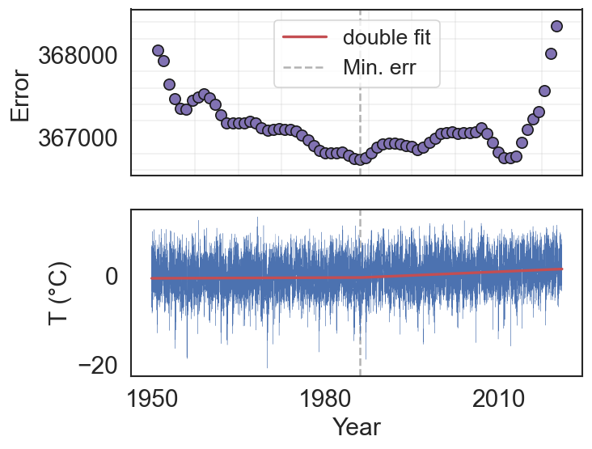

# Double-Trend-Analysis
These files are for calculating two linear fits with a point of intersection between the two in order to maximise the mean squared error.

The code for finding the two linear fits is written in Fortran and the code for plotting is written in python. 

